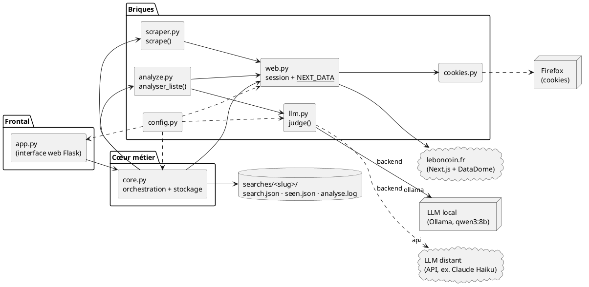
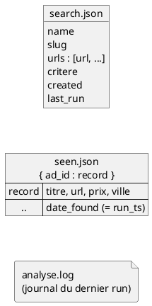
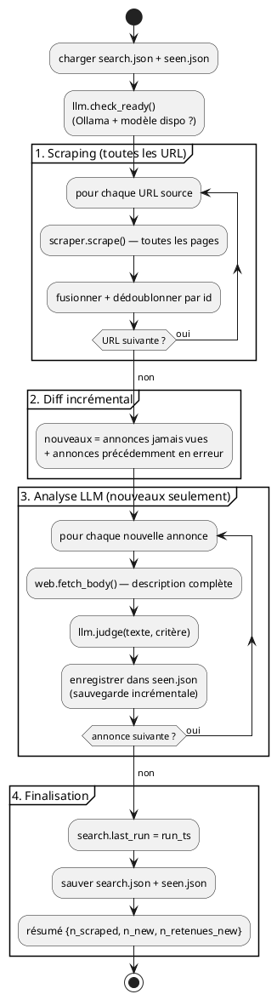
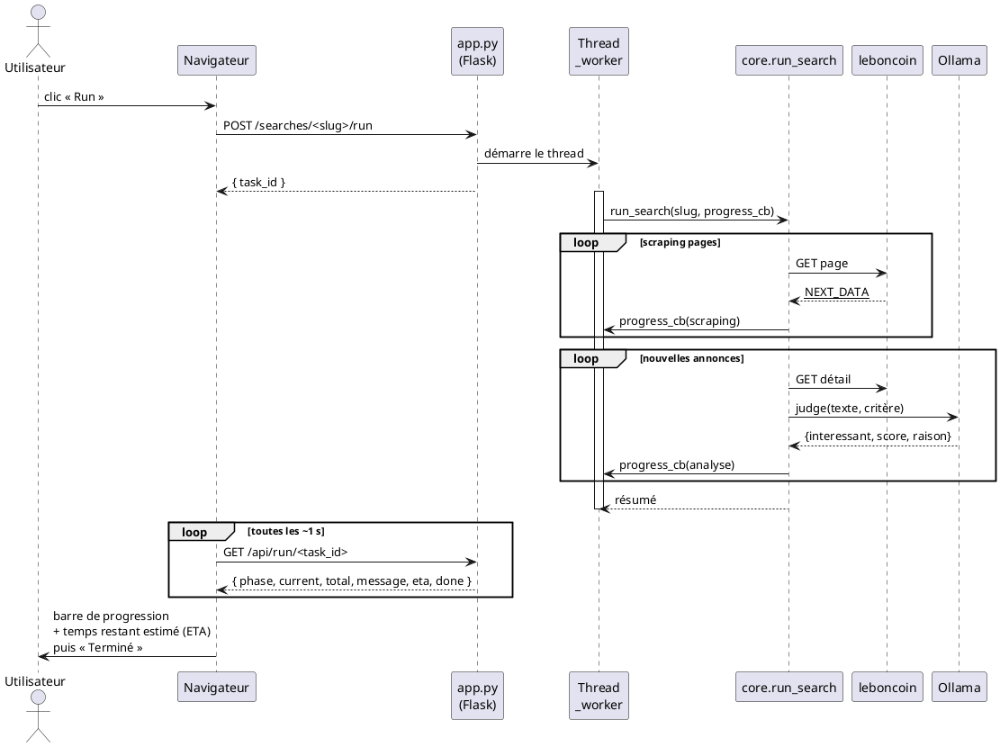
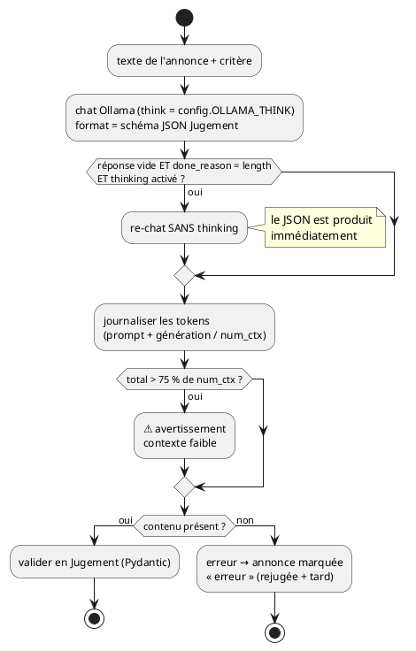
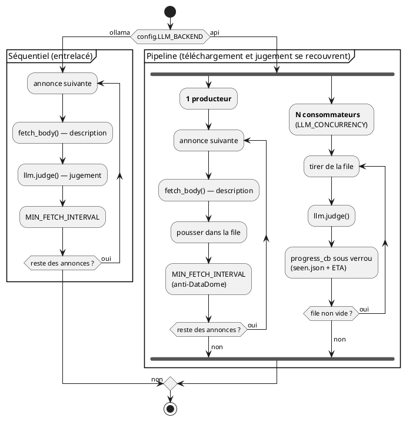
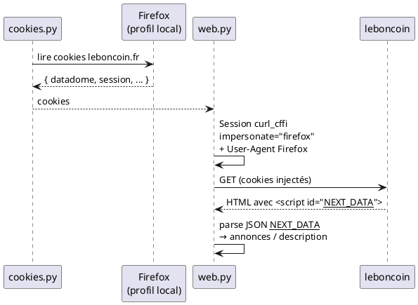
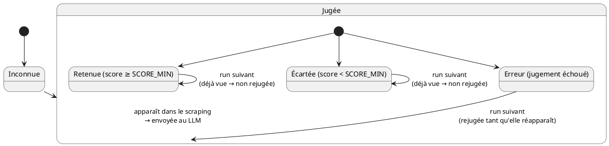

# Architecture & flux de données

## Vue d'ensemble des modules

lebonparser est découpé en modules à responsabilité unique. Le frontal web
(`app.py`) délègue tout au cœur métier (`core.py`), qui orchestre les briques
bas-niveau (scraping, accès web, LLM).

| Module | Responsabilité |
|---|---|
| `app.py` | serveur Flask : routes, threads de run, polling de progression. |
| `core.py` | stockage des recherches (`searches/`) + `run_search()` incrémental. |
| `scraper.py` | `scrape(session, url)` — parcourt toutes les pages d'une recherche. |
| `web.py` | session HTTP `curl_cffi` (empreinte Firefox) + extraction `__NEXT_DATA__`. |
| `cookies.py` | extrait les cookies leboncoin (dont `datadome`) du navigateur. |
| `analyze.py` | `analyser_liste()` — texte intégral + jugement LLM (séquentiel ou parallèle selon le backend). |
| `llm.py` | `judge()` — **sortie structurée** JSON validée (Pydantic) ; backend **Ollama** (local) ou **API** (distant, via Instructor). |
| `config.py` | réglages globaux (Ollama, seuils, délais, navigateur…) ; charge `.env` où vit toute la config du LLM distant. |

## Stockage : une recherche = un dossier

Tout l'état d'une recherche vit sous `searches/<slug>/`. `seen.json` est la **mémoire
centrale** qui rend les runs incrémentaux.

- **Historique retenu** = entrées de `seen.json` avec `score ≥ SCORE_MIN`.
- **Nouveautés du run** = entrées dont `date_found == search.last_run`.
- Une entrée marquée `erreur: true` (jugement LLM échoué) est **rejugée** au prochain
  run tant qu'elle réapparaît, au lieu d'être figée à 0.

## Flux d'un run (le cœur)

`core.run_search(slug)` enchaîne scraping → diff → analyse → sauvegarde. Le diff par
`id` est ce qui évite de rejuger l'existant.

## Séquence : un clic sur « Run »

L'app web lance le run dans un **thread d'arrière-plan** et publie l'avancement dans
un dictionnaire en mémoire (`RUNS`). Le navigateur **interroge** (polling) l'état
toutes les ~1 s — pas de Celery/Redis, inutile pour un usage local mono-utilisateur.

!!! tip "Temps restant estimé (ETA)"
    Pendant l'analyse, `core` estime le temps **restant** (temps écoulé ÷ annonces
    traitées × annonces restantes) et le joint à l'état (`eta`). Comme une annonce
    n'est comptée qu'une fois **téléchargée *et* jugée**, l'estimation reflète le
    **cycle complet**. Recalculée seulement **toutes les 10 annonces** pour un
    affichage stable, elle apparaît collée à droite de la ligne de progression.

## Jugement d'une annonce — backend Ollama (sortie structurée + filet anti-troncature)

`llm.judge()` demande à qwen3 un JSON conforme au schéma `Jugement`
(`interessant`, `score` 0-10, `raison`). En mode *thinking*, le raisonnement peut
épuiser le budget `num_predict` **avant** d'écrire le JSON (réponse vide,
`done_reason=length`) : dans ce cas, l'annonce est **rejugée sans thinking** pour
obtenir un verdict plutôt que de la perdre. *(Ce diagramme décrit le backend local
Ollama ; le backend API est décrit juste en dessous.)*

## Backend LLM : local (Ollama) ou distant (API parallélisable)

`config.LLM_BACKEND` choisit comment juger les annonces. `llm.judge()` masque la
différence ; c'est `analyze.analyser_liste()` qui adapte le **régime d'exécution**.

| | Backend `ollama` (local) | Backend `api` (distant) |
|---|---|---|
| Modèle | qwen3:8b via Ollama (GPU recommandé) | ex. Claude Haiku 4.5 via Instructor |
| Clé / coût | aucune | clé d'API (`.env` : `LLM_API_KEY`), ~1 €/run complet |
| Sortie structurée | `format` = schéma JSON | `response_model=Jugement` (retries auto) |
| Exécution | séquentielle, entrelacée | **pipeline : 1 téléchargeur séquentiel → N jugements parallèles** |
| Débit | latence GPU | **plafonné à `LLM_RPM`** (départs espacés) → aucun 429 |

Le point clé : aujourd'hui la **latence du LLM espace** naturellement les requêtes
vers leboncoin. Avec un LLM distant rapide et parallèle, ce garde-fou disparaît — il
faut donc **découpler** le téléchargement (seul accès à leboncoin, qui doit rester
séquentiel et throttlé contre DataDome) du jugement (sans accès réseau au site, donc
parallélisable sans risque). Les deux tournent en **pipeline** : un unique producteur
télécharge pendant que N consommateurs jugent les annonces déjà prêtes, si bien que la
durée totale ≈ **max**(téléchargement, jugement) au lieu de leur **somme**.

!!! note "Sécurité de l'incrémental"
    Le **producteur** n'appelle **pas** `progress_cb` : une annonce téléchargée mais pas
    encore jugée donnerait un enregistrement incomplet dans `seen.json`. Seul le
    **consommateur** persiste, après le verdict — un crash pendant le téléchargement se
    traduit donc par des annonces simplement **rejugées** au run suivant.

## Accès à leboncoin (contournement DataDome)

leboncoin est un site **Next.js** protégé par **DataDome**. La méthode retenue ne
pilote pas un navigateur : elle **réutilise la session Firefox** de l'utilisateur.

Si `__NEXT_DATA__` est absent, la page est probablement un *challenge* DataDome : il
faut recharger leboncoin dans Firefox (connecté) puis réessayer.

## Cycle de vie d'une annonce

C'est `seen.json` qui porte l'état d'une annonce d'un run à l'autre. Ce cycle
explique pourquoi un run quotidien ne juge que quelques annonces — et pourquoi une
annonce dont le jugement a échoué est automatiquement réessayée.

- **Retenue / Écartée** : enregistrée dans `seen.json`, elle ne sera **jamais
  rejugée** (économie de temps LLM au quotidien).
- **Erreur** : marquée `erreur: true`, elle est **rejugée** au prochain run tant
  qu'elle réapparaît dans les résultats — un échec transitoire (LLM, réseau) n'est
  donc pas figé à 0.
- L'**historique** affiché = toutes les *Retenue* ; les **nouveautés** = les
  *Retenue* dont `date_found` == `last_run`.
