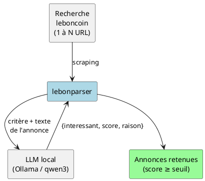

# lebonparser

**Scrute une (ou plusieurs) recherche leboncoin et ne garde que les annonces qui
t'intéressent vraiment — le tri est fait par un LLM qui tourne sur ta machine.**

## Le problème

Une recherche leboncoin renvoie souvent des centaines d'annonces, dont une majorité
hors sujet : mauvais modèle, mauvaise taille, article abîmé, accessoire au lieu du
produit… Les filtres natives du site (prix, catégorie, localisation) ne savent pas
juger une intention exprimée en langage naturel du genre :

> « une combinaison intégrale néoprène 3/4 mm, taille L/XL homme, en bon état —
> pas les gants/chaussons seuls, pas les modèles enfant. »

## La solution

lebonparser automatise trois choses :

1. **Récupérer** toutes les annonces d'une recherche (multi-pages, multi-URL).
2. **Juger** chaque annonce avec un **LLM local** (Ollama / qwen3) contre un
   **critère en langage naturel** : chaque annonce reçoit un score de 0 à 10.
3. **Présenter** les annonces retenues (score ≥ seuil), avec un suivi quotidien :
   un clic relance la recherche et **ne ré-analyse que les nouvelles annonces**.

## Points clés

- **100 % local et privé** : le jugement tourne sur ta machine (GPU/CPU), aucune
  annonce ni critère n'est envoyé à un service tiers.
- **Incrémental** : la mémoire des annonces déjà vues (`seen.json`) évite de rejuger
  ce qui l'a déjà été. Le 1er run analyse tout ; les suivants sont quasi instantanés.
- **Multi-recherches** : chaque recherche (nom + liste d'URL + critère) est
  enregistrée et relançable indépendamment.
- **Interface web locale** : une petite app Flask, lancée d'un double-clic, sans
  toucher au code.

## Pour qui ?

Pour quiconque surveille leboncoin au quotidien sur un besoin précis (matériel
d'occasion, pièces, instruments…) et veut éliminer le bruit sans relire 400 annonces
à la main chaque jour.

---

➡️ Commence par **[Utilisation](utilisation.md)**, puis va voir
**[Architecture & flux de données](architecture.md)** pour comprendre l'intérieur.
